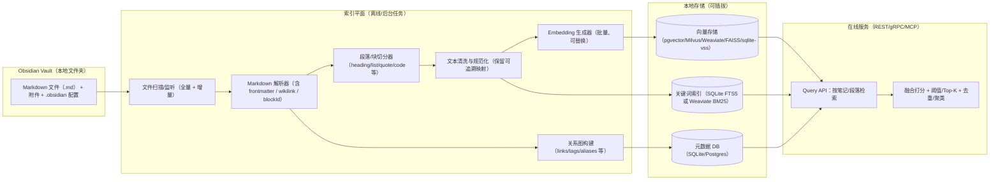

# 基于 AI 的 Obsidian 双链笔记关联分析系统方案设计文档

## 执行摘要

本文给出一个“本地部署、纯后端”的笔记关联分析系统设计：面向 Obsidian Vault（Markdown）对**全量文件**进行解析，将每篇笔记切分为“段落/块（block）”级单元，为每个段落建立语义向量索引与可选的关键字索引；在查询时对“单个笔记的每个段落”自动检索并返回与历史笔记库中**其他段落或整篇笔记**最相关的内容，支持可配置的相似度阈值与 Top-K。系统以 REST API / gRPC 形式提供服务，并可额外封装为 MCP Server，便于 AI Agent 以统一协议调用（工具/资源/提示模板）。

语义部分可选用 OpenAI 的 Embeddings API 生成向量（支持批量输入、可选降维 dimensions 参数，且有每输入最大 token 数与单次请求总 token 上限约束）

存储和检索采用Milvus存储向量数据，sqlite存储普通元数据（注意部分示例中可能出现Weaviate，实现中都采用milvus）

编码语言采用python

重点：
整个索引系统独立与obsidian的文件系统，不会修改任何原始笔记文件

## 目标与需求拆解

系统目标是把 Obsidian Vault 变成“可编程的段落级知识图谱 + 语义检索库”，并围绕以下核心能力提供接口：

1) **输入数据与格式约束**  
Obsidian 支持 Wikilink（`[[...]]`）与 Markdown 链接两种内部链接形式；支持链接到标题（`#`）与块（`#^blockId`），并可用 `!` 前缀嵌入（embed）链接内容。系统需要解析这些语法以提取“显式关系”和“检索提示特征”。https://help.obsidian.md/links

2) **段落/块级索引**  
两种索引基本单元：
1. 段落（markdown的标题） eg. [[1.1.1 openclaw记忆#memory 的基本分层]]
2. 块（obsidian的block） eg. [[1.1.1 openclaw记忆#^82cf3e]]

当建立引用时，优先选择段落作为引用的目标。当内容和某个block的相关性极高时，采用block作为引用的目标
系统要能识别并对齐这些块边界，确保索引单元稳定可追踪


3) **可配置相似度阈值与 Top-K**  
对每个段落（以及可选的整篇笔记向量）执行近邻检索与重排，返回超过阈值的候选，且支持 Top-K 与阈值可配置。

4) **全量构建 + 增量更新**  
首次对指定文件夹全量扫描并建库；后续能检测新增/修改/删除文件并增量更新索引，保证结果与本地文件一致。  

5) **服务形态**  
无前端，通过 REST API / gRPC 提供服务；同时以 MCP Server 形式暴露“检索工具”，供 AI Agent 以 JSON-RPC 协议统一调用。MCP 的目标是用标准协议把 AI 应用连接到外部数据与工具，规范了 tools/resources/prompts 等原语与传输/数据层。

5) **混合检索**  
为避免单一路径检索的盲区，系统默认采用混合检索策略：仅依赖 dense 向量检索，容易漏掉精确术语、代码标识符、缩写与专有名词；仅依赖关键词检索，又容易漏掉改写、近义表达与跨表述方式的语义关联。Milvus 2.5+ 已提供基于 BM25 的原生全文检索能力，并支持将 dense embedding 检索与 BM25 sparse 检索组合为 hybrid search。工程上可对同一段落同时执行 dense 召回与 sparse/BM25 召回，再在服务层进行分数融合与重排，从而同时覆盖“语义相关”与“字面精确命中”两类关联信号。对于需要本地轻量关键词对照召回的场景，也可使用 SQLite FTS5 的 bm25() 作为补充实现。

## 系统总体架构

系统采用“离线索引管线 + 在线查询服务”的双平面结构：索引管线负责解析、切分、向量化与入库；查询服务负责接收请求、召回候选、融合多路信号（语义/关键词/图结构），并输出可解释的关联结果。



## 数据处理与索引构建

本节以“模块划分 + 数据结构 + 算法伪代码”的方式给出可直接出码的设计。

### 模块划分与职责边界

**文件解析（File Parser）**  
目标：把 `.md` 文件解析为结构化对象 `NoteDoc`，提取：
- Frontmatter（YAML properties / tags / aliases 等）：Obsidian 指出 properties 存储在文件顶部的 YAML 中，且 `tags` 是默认属性之一，标签在 YAML 中以列表形式存储。citeturn4view2turn12view0
- 内部链接：支持 Wikilink 与 Markdown 链接两种格式；支持标题锚点与块锚点；支持 `!` embed 前缀。
- 该笔记的“候选实体字典”：文件名、aliases、标题层级（用于 unlinked mentions / 词典增强）。

**段落切分（Block Splitter）**  
目标：把笔记正文切成 block 列表（段落/列表项/引用块/Callout/代码块等），并为每个 block 记录：
- `block_id`：若存在 `^id` 则直接采用；Obsidian 允许对段落在行尾追加空格 + `^id`，对结构化块可在独立行放置 `^id`。
- `heading_path`：该块所在标题路径（例如 `["项目A","风险","隐私"]`），用于“结构上下文召回”。
- `char_range`：在原文中的字符起止位置，支持回显高亮。

**文本清洗（Cleaner）**  
目标：生成用于 embedding/关键词索引的 `clean_text`，并保留到 `raw_text` 的映射。典型规则：
- 去除 frontmatter、HTML 注释、仅格式符号；保留自然语言与关键术语。
- 将 wikilink 展平：例如 `[[Note|显示名]]` → `显示名`（同时存储 link target 作为结构化字段）。
- 可配置是否索引代码块：对技术笔记常有价值，但会影响噪声与 embedding 质量（建议默认“单独块索引”，并在检索时可过滤）。

**Embedding 生成（Embedder）**  
目标：对每个 block 的 `clean_text`（或适当的上下文窗口）生成向量并入库。OpenAI embeddings API 支持一次请求传入字符串数组以批量生成向量，并对输入 token 数有上限约束（每输入最大 tokens、单次请求总 tokens），text-embedding-3 还支持 `dimensions` 参数控制输出维度。

**向量存储与检索（Vector Store Adapter）**  
目标：屏蔽底层差异，提供统一接口：
- `upsert(vectors, metadata)`
- `delete(ids)`
- `search(query_vector, top_k, filters)`  
Milvus：支持 COSINE/IP/L2 等多种度量以及 BM25（稀疏向量全文检索场景）
**关键词索引（Lexical Index）**  
- SQLite FTS5：bm25() 返回更匹配更小的值，可用 `ORDER BY bm25(...)` 排序；也支持 snippet/highlight。

**相似度计算与阈值配置（Scoring）**  
提供多信号融合：
- `semantic_score`：向量相似度（cosine similarity / IP 等）。
- `lex_score`：BM25 或关键词匹配得分。
- `graph_boost`：显式链接/同标签/同项目目录等加权。
- `mmr/diversity`：避免 Top-K 全来自同一个笔记或同一段落改写。

**去重、聚类与返回整篇关联（Post-process）**  
- “段落去重”：相同或极相似文本合并。
- “笔记聚合”：把相同 note 的多个高分段落聚合成 note-level 关联结果（并提供代表段落）。
- “簇聚类”（可选）：对候选段落进行轻量聚类，构建“主题簇”便于下游自动双链建议。

---

### 数据模型与本地表结构建议

以下以“元数据 DB + 向量库（或向量列）”的抽象给出表结构；

**表：notes**
- `note_id` (UUID / int)  
- `path`（相对 vault 路径，唯一）
- `title`（默认文件名）
- `aliases`（JSON array）
- `tags`（JSON array；也可范式化到 note_tags）
- `frontmatter`（JSON）
- `mtime`（文件修改时间）
- `content_hash`（用于增量更新）

**表：blocks**
- `block_uid`（全局唯一：`${note_id}:${block_id}` 或 UUID）
- `note_id`
- `block_id`（Obsidian 的 `^id` 或虚拟 id）
- `heading_path`（JSON array）
- `raw_text`
- `clean_text`
- `char_start`, `char_end`
- `token_count_est`（用于分段与批量策略）
- `block_hash`（clean_text hash，用于去重）
- `updated_at`

**表：links**
- `src_note_id`, `src_block_uid`（可空：链接在笔记或块层）
- `dst_note_path`（解析后的目标）
- `dst_heading`（可空）
- `dst_block_id`（可空）
- `link_text`（显示名/anchor）
- `type`（wikilink/mdlink/embed）

**表：block_vectors（如向量不在外部库）**
- `block_uid`
- `embedding`（向量列/bytea）
- `model`（embedding 模型名）
- `dims`
- `norm`（可选，用于归一化）

---

### 关键算法设计（伪代码 + 复杂度）

#### 分段策略：Markdown → Block 列表

原则：尽可能贴近 Obsidian “块”的语义边界（段落、列表项、引用等），并在超长块时二次切分（滑动窗口 / 句子级）以适配 embedding 输入上限。Obsidian 明确块可为段落/引用/列表项等文本单元，且块标识 `^blockId` 的位置对段落与结构化块有不同规则。citeturn4view0turn9view1

```pseudo
function split_into_blocks(markdown_text):
  ast = parse_markdown_to_ast(markdown_text)

  blocks = []
  current_heading_path = []

  for node in ast.traverse_in_order():
    if node.type == HEADING:
      current_heading_path = update_heading_stack(current_heading_path, node.level, node.text)
      continue

    if node.type in {PARAGRAPH, LIST_ITEM, BLOCKQUOTE, CALLOUT, TABLE, CODE_BLOCK, MATH_BLOCK}:
      raw = node.raw_text
      block_id = detect_obsidian_block_id(raw, lookahead_lines=true)
      blocks.append({
        raw_text: raw,
        heading_path: current_heading_path,
        block_id: block_id or null,
        char_range: node.char_range,
        node_type: node.type
      })

  # second-pass: enforce min/max length
  blocks2 = []
  for b in blocks:
    if is_too_short(b.raw_text): merge_with_neighbors(blocks2, b)
    else if is_too_long(b.raw_text): blocks2.extend(split_long_block(b))
    else blocks2.append(b)

  return blocks2
```

复杂度：Markdown 解析与遍历通常为 O(L)（L 为文本长度）；二次切分与合并为 O(B)（B 为块数），整体近似 O(L)。  

#### 上下文窗口选择：为每块构建用于 embedding 的输入

在“段落关联”场景，下游经常需要上下文以降低歧义。建议提供三种可配置模式：
- `SELF`：仅本段落  
- `SELF+HEADING`：段落前追加标题路径（例如 `项目A / 隐私`）  
- `SLIDING`：合并前后相邻 N 段落（例如 N=1 或 2），并用分隔符标记边界

```pseudo
function build_embedding_input(blocks, i, mode, window):
  if mode == SELF:
    return clean(blocks[i].raw_text)
  if mode == SELF_HEADING:
    return join(blocks[i].heading_path, " / ") + "\n" + clean(blocks[i].raw_text)
  if mode == SLIDING:
    j0 = max(0, i-window)
    j1 = min(len(blocks)-1, i+window)
    return concat_with_markers([clean(blocks[j].raw_text) for j in j0..j1])
```

复杂度：每段构建输入 O(W)（W 为窗口大小，常数），全笔记 O(P·W)（P 为段落数）。  

#### 向量相似度与候选召回

OpenAI 指出 embedding 向量之间的距离可衡量相关性，距离小代表更相关。
在实现层面建议统一使用 cosine similarity（或对归一化向量使用 inner product）。Milvus 文档也指出对归一化向量，IP 与 cosine 等价；并解释了 cosine 的取值与意义。=

```pseudo
function retrieve_candidates(query_block_uid, query_vec, top_k, filters):
  # ANN search in vector store
  cand = vector_store.search(query_vec, top_k = top_k_ann, filters = filters)

  # optional: compute exact similarity for rerank
  scored = []
  for c in cand:
    sim = cosine(query_vec, c.vec)  # if stored vectors normalized, dot(query, c)
    scored.append((c, sim))
  return sort_desc(scored)
```

复杂度：  
- 近似 ANN：取决于后端索引。以 pgvector 为例，HNSW/IVFFlat 属于 ANN，权衡 recall 与速度；并提供 `ef_search`/`probes` 等查询参数。citeturn14view1  
- 精排：O(k·d)（k 为候选数，d 为向量维度）。  

#### 混合检索融合：语义 + 关键词（BM25）

建议统一融合为一个可解释的总分：

```pseudo
# assume semantic_score in [0,1] after normalization
# lexical_score in [0,1] after min-max or sigmoid normalization
# graph_boost in [0,1] (or additive small constant)

final = w_sem * semantic_score
      + w_lex * lexical_score
      + w_graph * graph_boost

keep results where final >= threshold
return top_k by final
```

复杂度：召回 O(ANN + BM25)，融合 O(k)。  

#### 去重与聚类

**去重（同段落重复/近重复）**：用 `block_hash`（规范化文本 hash）做硬去重；再用向量相似度做软去重（例如 sim>0.98 视为重复，保留最新或更长者）。

```pseudo
function dedup(results, sim_threshold):
  kept = []
  for r in results_sorted:
    if any(cosine(r.vec, k.vec) > sim_threshold for k in kept):
      continue
    kept.append(r)
  return kept
```

复杂度：最坏 O(k^2·d)，k 通常是小常数（例如 50~200）；可用近似或桶分组优化为 O(k·log k)。  

**聚类（可选）**：对 Top-N 候选做轻量聚类（如基于相似度的连通分量或 HDBSCAN/KMeans），用于输出“主题簇”。建议仅在离线分析或用户显式请求时启用，避免在线延迟放大。

---

### 可配置参数清单与默认建议值

以下给出“出码友好”的配置项（YAML/JSON 均可），默认值为保守、通用的起点；实际应通过验收集与用户反馈调整阈值与权重。

- `vault_path`: 必填  
- `include_glob`: `["**/*.md"]`  
- `exclude_glob`: `["**/.obsidian/**","**/.trash/**","**/node_modules/**"]`  
- `block_split`  
  - `min_chars`: 80（过短则与邻块合并）  
  - `max_chars`: 1200（过长则二次切分）  
  - `window_mode`: `"SELF_HEADING"`  
  - `window_neighbors`: 1  
  - `index_code_blocks`: true（技术向），或 false（纯阅读向）  
- `cleaning`  
  - `strip_frontmatter`: true（frontmatter 可单独作为结构化字段索引）  
  - `normalize_whitespace`: true  
  - `wikilink_display_text_prefer_alias`: true  
- `embedding`  
  - `provider`: `"openai"` 或 `"local"`  
  - `model`: `"text-embedding-3-small"`（默认）或 `"text-embedding-3-large"`（更强）citeturn9view0turn13view1turn13view0  
  - `dimensions`: null（用模型默认）或显式整型（仅 text-embedding-3+ 支持）citeturn9view1  
  - `batch_size`: 128（注意 token 总量上限）citeturn9view1  
- `retrieval`  
  - `top_k`: 10（最终返回）  
  - `top_k_ann`: 80（召回后精排/融合）  
  - `threshold`: 0.55（融合分数阈值，需调参）  
  - `weights`: `{sem: 0.75, lex: 0.20, graph: 0.05}`  
  - `dedup_sim_threshold`: 0.98  
  - `group_by_note`: true（输出 note-level 汇总）  
- `incremental`  
  - `watcher`: `"auto"`（Linux 优先 inotify；否则轮询）  
  - `poll_interval_sec`: 5  
  - `reindex_debounce_ms`: 800  
- `security`  
  - `bind_host`: `"127.0.0.1"`（默认仅本机访问）  
  - `auth`: `"token"`（本地也建议最小鉴权）  

---

## 检索与 API 设计

本节给出 REST、gRPC、MCP 三种对外接口的建议形态。你可以先实现 REST（最快），再用同一 service layer 复用到 gRPC/MCP。

### REST API 设计与示例

**索引类**
- `POST /v1/index/rebuild`：全量重建（可异步 job）
- `POST /v1/index/sync`：增量同步（扫描差异并更新）
- `POST /v1/index/file`：对单文件强制重建（调试/手工触发）
- `GET  /v1/index/status`：返回数据库版本、索引大小、最近同步时间

**查询类**
- `POST /v1/query/note`：输入笔记路径，输出“该笔记每个段落 → 关联段落/笔记”
- `POST /v1/query/block`：输入 block_uid 或临时文本，找相似段落
- `POST /v1/query/search`：纯搜索接口（语义/关键词/hybrid 可选）

**示例：查询整篇笔记的段落关联**

请求：
```json
POST /v1/query/note
{
  "note_path": "项目/隐私设计.md",
  "top_k": 10,
  "threshold": 0.55,
  "return_mode": "paragraph_and_note",
  "filters": {
    "exclude_same_note": true,
    "tags_any": ["privacy", "security"]
  }
}
```

响应（示意）：
```json
{
  "note_path": "项目/隐私设计.md",
  "note_summary": {
    "related_notes": [
      {
        "note_path": "架构/本地索引服务.md",
        "score": 0.82,
        "top_blocks": [
          { "block_uid": "n12:^a1b2c3", "score": 0.84, "snippet": "……" }
        ]
      }
    ]
  },
  "blocks": [
    {
      "block_uid": "n34:^quote-of-the-day",
      "heading_path": ["隐私","威胁模型"],
      "text": "……",
      "matches": [
        {
          "match_block_uid": "n12:^37066d",
          "match_note_path": "架构/本地索引服务.md",
          "score": 0.84,
          "explain": {
            "semantic": 0.90,
            "lexical": 0.60,
            "graph_boost": 0.05,
            "signals": ["shared_tag:privacy", "explicit_link:[]"]
          }
        }
      ]
    }
  ]
}
```

### gRPC 服务定义建议

gRPC 适合高并发与严格 schema；建议 proto 聚焦领域对象，避免把存储细节暴露给客户端。核心 RPC：
- `RebuildIndex(RebuildRequest) returns (JobStatus)`
- `SyncIndex(SyncRequest) returns (JobStatus)`
- `QueryNote(QueryNoteRequest) returns (QueryNoteResponse)`
- `QueryBlock(QueryBlockRequest) returns (QueryBlockResponse)`

### MCP Server 封装建议

MCP 的定位是让 AI 应用以统一协议发现并调用你的工具/资源；其规范将协议分为数据层（基于 JSON-RPC 2.0 的消息结构与语义）和传输层，并定义 tools/resources/prompts 等核心原语。citeturn12view3turn10view9turn12view2  
Anthropic 介绍 MCP 的目标是用开放标准把 AI 助手连接到数据与工具系统，支持 MCP server 与 MCP client 的双向连接模式。citeturn15view0

你可以把本系统封装为 MCP server，暴露如下 tools（示例）：
- `vault.query_note_related`：输入 note_path，返回段落关联结果  
- `vault.query_text_related`：输入自由文本，返回相似段落  
- `vault.index_sync`：触发增量同步（高风险操作，需鉴权/确认）

注意：MCP tools 规范的安全建议强调应允许“人类在环”拒绝工具调用（SHOULD），并通过 UI/确认提示降低误调用风险；即使你是无前端服务，也应在 API 层实现等价机制（权限控制、幂等、危险操作需要 confirm token）。citeturn12view2

---

## 增量索引、并发与性能考虑

### 增量索引策略

建议采用“双通道”检测：文件系统事件监听为主，周期性全量校验为辅。

**状态记录**
- 对每个文件保存：`mtime`、`size`、`content_hash`  
- 对每个 block 保存：`block_hash`（clean_text hash），用于判断段落是否真正变化

**更新流程**
1) 监听或扫描得到变更集合：`added/modified/deleted`  
2) 对 modified 文件：
   - 重新解析并切分为 blocks
   - 与旧 blocks 做 diff（基于 `block_id` 优先，其次 `block_hash` + 位置）
   - 仅对新增/变更 blocks 重新 embedding 与 upsert
   - 对消失 blocks 做 delete
3) 对 deleted 文件：级联删除 notes/blocks/links/vectors

这种设计在用户频繁编辑时能显著降低 embedding 成本（通常是全链路最贵环节）。OpenAI embeddings API 支持批量输入，可将“多个 blocks”合并成一次请求以提升吞吐，但必须遵守 token 上限与单次请求总 token 上限。citeturn9view1

### 并发模型

推荐“流水线 + 有界队列”：
- I/O 线程：扫描/读取文件
- CPU 线程：Markdown 解析、清洗、分段
- GPU/外部调用线程：embedding 生成（可 batch）
- DB 写入线程：批量写入（事务）

**关键点**
- embedding 生成器按 batch 聚合：以 token 总量为约束，而不是仅按条数；避免超过 embeddings API 上限。citeturn9view1  
- 写入向量库时尽量批量提交：例如 pgvector/SQL 端批量 insert；Milvus/Weaviate 也更适合批量导入。

### 向量索引与性能参数建议

不同后端的性能调优要点：

- **pgvector（Postgres）**  
  支持 exact 与 ANN；ANN 支持 HNSW/IVFFlat，并明确给出了 HNSW 的 `m / ef_construction / ef_search` 与 IVFFlat 的 `lists / probes` 等参数建议；HNSW 在 speed-recall 上通常优于 IVFFlat，但构建更慢、占用更多内存。citeturn14view1turn10view7  

- **Weaviate**  
  文档指出其 HNSW 索引查询很快，但新增向量时重建/维护可能资源密集。citeturn10view5  

- **Milvus**  
  支持多种 metric（L2/IP/COSINE 等），并提供多类索引（FLAT/IVF/HNSW 等）。Milvus Standalone 适合单机部署。citeturn10view2turn8search6turn10view3  

- **SQLite + sqlite-vss**  
  sqlite-vss 文档提示 `vss_search()` 的 `limit N` 在 SQLite 3.41+ 才正常工作（早期版本受 bug 影响）；因此要么约束 SQLite 版本，要么在 SQL 层使用替代参数接口。citeturn10view1  

- **FAISS（库内嵌）**  
  FAISS 是高效相似度搜索与聚类库，支持超大规模向量集与 GPU 实现；适合“把索引内嵌进你的服务进程”以降低部署复杂度。citeturn10view0  
  若选 SQLite 向量检索，sqlite-vss 明确基于 FAISS。citeturn1search3turn10view1  

---

## 数据隐私、本地部署注意事项、测试与验收、技术选型对比、部署运维建议

### 数据隐私与安全风险及缓解措施

**风险一：笔记内容出网（embedding 调用第三方）**  
若使用 OpenAI embeddings，笔记段落会作为 API 输入发送到外部服务；这与“本地数据库”并不冲突，但与“数据绝不出网”的隐私目标可能冲突。缓解：
- 提供 `embedding.provider=local` 的替代实现（同接口），在本地生成向量；
- 对敏感目录启用 `exclude_glob` 或 `redaction_rules`（正则脱敏：密钥/邮箱/手机号等）；
- 为所有对外调用配置专用 API Key、最小权限与速率限制。OpenAI 文档指出 embeddings 请求按 token 计费且存在 token 限制，工程上应做 token 预算与截断策略，避免异常输入导致意外出网量与成本。citeturn9view0turn9view1  

**风险二：索引库泄露（本地 DB 也是敏感资产）**  
向量与关键词索引往往可被“反向检索/成员推断”利用。缓解：
- DB 文件/数据目录按 OS 权限隔离（仅服务账号可读写）；
- 备份加密（例如磁盘加密/备份侧加密）；
- API 默认只监听 localhost（`127.0.0.1`），远程访问必须走反向代理 + mTLS 或 Token。

**风险三：MCP/工具调用被滥用**  
MCP tools 允许模型调用外部系统；规范强调应提供人类拒绝能力与清晰提示。对无前端服务，缓解方案是：
- 鉴权：token + role（只读/可索引/可删除）；
- 危险操作（rebuild/delete）要求双重确认（`confirm_token`）与操作审计；
- 资源访问限制：仅允许访问配置的 vault_path 之下文件。citeturn12view2turn12view3  

### 测试用例与验收标准

建议把验收拆成“正确性、稳定性、性能、可运维”四类。

**正确性**
- 用例：解析内部链接  
  - 输入包含 Wikilink、Markdown link、标题链接、块链接、嵌入 `![[...]]` 的笔记；期望正确抽取 targets 与类型。Obsidian 文档明确支持这些语法与块链接 `#^`。citeturn4view0  
- 用例：块切分与 blockId 识别  
  - 段落末尾 `^id`、结构化块独立行 `^id` 均能被识别；`block_uid` 稳定。citeturn4view0  
- 用例：标签/frontmatter  
  - frontmatter YAML 能解析；tags 列表能识别（inline `#tag` 与 YAML tags）。citeturn4view2turn12view0  

**增量索引一致性**
- 新增文件：索引条目增加且可检索  
- 修改文件：仅受影响 blocks 的向量更新时间变化  
- 删除文件：相关 blocks/links/vectors 清理干净（无“幽灵结果”）

**性能（建议给出可量化门槛）**
- 索引吞吐：例如 10k blocks 的首次索引在可接受时间内完成（取决于 embedding 后端）  
- 查询延迟：单笔记 50 段落的关联分析在 1s~3s（本地 ANN）或 3s~10s（含外部 embedding/重排）范围内（需按机器规格设定）  
- 资源：Weaviate 本地 quickstart 建议至少 8GB RAM（更推荐 16GB+）作为运行 Weaviate 与本地模型的参考下限。citeturn10view6  

**可运维**
- `GET /health` 返回数据库连通、索引版本等  
- 日志包含：索引批次、失败重试、异常输入截断  
- 指标：索引队列长度、embedding 耗时、QPS、P95 延迟

### 可选技术栈与优缺点对比（表格）

| 维度 | SQLite + FTS5 + sqlite-vss | Postgres + pgvector | Milvus Standalone | Weaviate（自托管） | FAISS（内嵌） |
|---|---|---|---|---|---|
| 部署复杂度 | 很低（单文件 DB；需装扩展） | 中（需要 Postgres） | 中（Docker 单机） | 中（Docker Compose） | 低（库依赖；需自建元数据） |
| 关键词检索 | FTS5 bm25() 内置citeturn10view8 | 可用 PG 全文检索（未在本文展开） | 需额外组件或稀疏向量路线 | BM25 与 hybrid 原生支持citeturn10view4 | 需额外组件 |
| 语义检索 | sqlite-vss 基于 FAISSciteturn1search3 | cosine distance 等，支持 ANN、HNSW/IVFFlatciteturn10view7turn14view1 | 多 metric、多索引；Standalone 便捷citeturn10view2turn10view3 | hybrid 与 HNSW；增量维护可能更重citeturn10view5 | 高效相似度搜索与聚类，支持 GPUciteturn10view0 |
| 扩展性 | 单机中小规模 | 单机到中等规模强 | 更偏向向量数据库扩展 | 功能丰富、生态全 | 取决于你自己实现 |
| 推荐场景 | 个人/小团队、轻量本地 | 需要 SQL、事务、统一存储 | 更专业向量检索、多索引调参 | 想要开箱 hybrid/Schema | 想把索引嵌入进服务进程 |

补充说明：若你希望“一个系统同时解决 BM25 + 向量 + 融合”，Weaviate 的 hybrid search 定义非常直接；若你希望“关系数据 + 向量同库管理”，pgvector 适配度更高；若你希望“极简本地单文件”，SQLite 路线性价比最佳，但注意 sqlite-vss 与 SQLite 版本兼容细节。citeturn10view4turn14view1turn10view1

### 示例数据流与接口交互示例

**首次建库（全量）**
1) 调用 `POST /v1/index/rebuild`  
2) Watcher 遍历 vault 下 `.md` 文件（排除 `.obsidian` 等）  
3) Parser 抽取 properties（YAML）、tags、links；Splitter 产生 blocks 并识别 `^blockId`citeturn4view2turn4view0turn12view0  
4) Cleaner 输出 clean_text  
5) Embedder 批量调用 embeddings 或本地 embedding；OpenAI embeddings 支持数组输入批量生成向量citeturn9view1  
6) 写入 VecStore、LexIndex、MetaDB  
7) `GET /v1/index/status` 返回索引版本与统计

**查询单笔记段落关联**
1) 客户端 `POST /v1/query/note`  
2) 服务端读取 note 的 blocks（若 embedding 已存在则直接用；否则可 on-demand 生成并缓存）  
3) 对每段落执行向量 ANN + 可选 BM25 召回，融合得分并阈值过滤  
4) 去重、按 note 聚合，返回结构化结果（段落级 + 笔记级）

**增量更新**
1) 文件改动触发 Watcher  
2) `index_sync` 任务解析变更文件并仅更新受影响 blocks  
3) 旧 blocks/vectors 删除、变更 blocks upsert

### 部署与运维建议
API 服务 + Milvus + SQLite
**运维要点**
- 索引版本化：为 `notes/blocks/vectors` 引入 `schema_version`；升级时跑迁移脚本  
- 备份：定期备份元数据 DB 与向量库数据目录；恢复后 `index/status` 校验  
- 观测：记录每批 embedding 的条数、token 预算、失败重试；对外提供 `/metrics`（Prometheus）  
- 限流：对查询与索引接口分开限流；对 rebuild 这类重操作加鉴权与审计  
- 可回放：保留最近 N 次索引任务的 diff/日志，便于定位“为什么关联结果变化”  

至此，该方案满足“无前端、API/MCP 服务化、本地数据库、Obsidian 语法解析、段落级索引与关联、阈值与 Top-K 可配、全量 + 增量索引”的全部要求，并且提供了可直接用于工程实现的模块边界、数据结构、算法伪代码与上线运维要点。citeturn4view0turn9view1turn10view4turn12view3