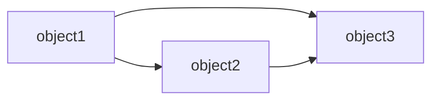
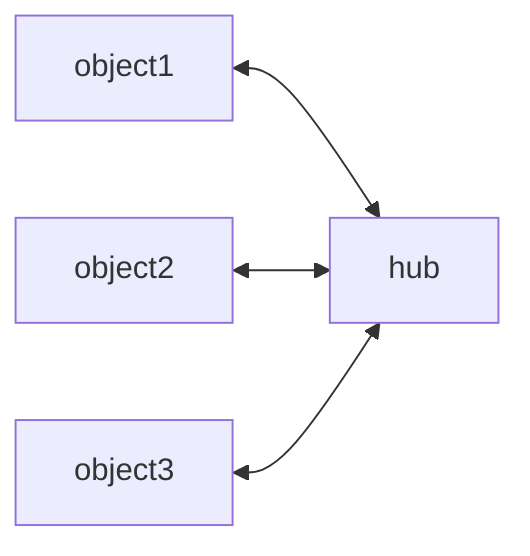
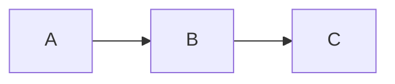

---
{}
---

453## 概要
1. 依赖注入是实现控制反转的一种方式
2. 目的是降低复杂系统中对象间的相互耦合
3. 一般谈到依赖注入其实是在谈论依赖注入框架IOC

依赖注入框架其实叫做==依赖自动分析和初始化==更为明了

依赖注入是最常见的控制反转，但是还存在其它的实现方式：
1. 服务工厂
2. 插件

==[[12.9 依赖倒置DIP]] 和依赖注入（DI）不是一回事==
依赖倒置一般只上下层都依赖一套公共的抽象，所以下层变动时对上层影响很小，依赖注入解决的是==当对象间依赖关系复杂时如何实现自动化的依赖分析及初始化（IOC框架）==

## 依赖注入的原理
当系统比较复杂时，多个对象之间会相互耦合，对单个对象的修改可能对全局有较大的影响



解决的思路之一是引入一个hub，来作为大家相互链接的中介，从而减少对象间相互链接的数量



所有object之间不相互发生耦合，也就没有相互依赖
依赖是由hub“注入”到object里面的，所以被称作依赖注入（DI）

这样的hub倍称作IOC容器（Inversion of Control）

非依赖注入的情况下，如第一个图，object1依赖于object2，在IOC下，IOC会创建一个object2对象，并将这个对象set到object1中
从object1主动创建一个object2，到object1被动接收了一个IOC创建的object2，object1的控制权被IOC获取（反转）了

## golang实现的依赖注入框架
存在三个有依赖关系的类

A在最上层，C在最底层
对A进行初始化的代码如下：
```go
type A struct {
	b *B
}

type B struct {
	c *C
}

type C struct {

}

//创建一个对象A
c := &C{}
b := &B{c:c}
a := &A{b:b}
```
如果没有依赖注入，会导致的问题：
1. A对象的初始化变得非常复杂，必须从最底层的C开始，一步一步构造，直到最上层的A
2. 如果系统存在非常复杂的依赖关系，A的构造将会非常的繁复，必须理清楚相互的依赖并从最底层开始逐步初始化

DI框架存在的目的就是将这种初始化自动化：
1. 自动分析出谁依赖睡这件事情
2. ==本质是个递归的过程==，例如从A开始进行递归分析，指导最底层，再逐级返回
3. 最底层的对象需要预先传给DI框架，应为递归的过程需要这样的返回点

常见的DI开源框架：uber-go/dig，facebookgo/inject，google/wire
以facebookgo/inject为例，有依赖注入的代码会变为如下：
```go

type A struct {
	b *B	`inject:""` //inject tag代表这是一个需要被自动注入的对象
}

type B struct {
	c *C	`inject:""` //默认是单例模式，除非设置为inject:privete
}

type C struct {
}

a := &A{}
b := &B{}
c := &C{}

graph := inject.Graph{} //初始化IOC容器


//向容器中添加各种需要被注入的对象
//这里的c其实是不需要被注入的，应为它不依赖其它，这是递归的一个折返点
//如果没有这样的折返点，递归是无法完成的

if err := graph.Provide(
	&inject.Object{
		Value: a,
	},
	&inject.Object{
		Value: b,
	},
	&inject.Object{
		Value: c,
	},
); err != nil {
	panic(err)
}

//发起注入，这一步结束后所有的对象都被自动填充好了
if err := graph.Populate(); err != nil {
   	panic(err)
 }

//A对象已经是一个完整可用的对象了
xx := A.b

```
## 缺点
1. IOC容器的引入增加了系统的复杂性
2. IOC容器生成对象的方式基于反射，性能较差
3. IOC框架产品（如sping）的配置和学习成本都比较高