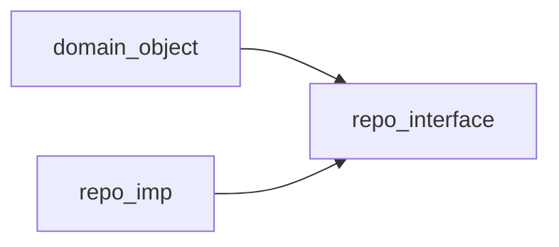

---
{}
---

## 概要
1. 上层模块不应该依赖底层模块，他们都应该依赖于抽象
2. 抽象不应该依赖于细节，细节应该依赖于抽象

## 例子
举一个DDD中repo的例子

非依赖倒置的情况


依赖倒置的情况

golang的示例
```go

//A直接依赖B
type A struct {
	b B
}

//////////////////////////////
//依赖倒置的写法
type BInterface Interface {
	Func1()
	Func2()
}

//A依赖抽象接口
type A struct {
	b BInterface
}

//B实现抽象接口
type B struct {
}

func (b B) Func1(){
}
func (b B) Func2(){
}
//基于多态的初始化
a := A{b:B{}}
```
这样领域对象就不用依赖一个特定的repo实现，只需要依赖repo的接口，这样带来的好处：
1. 利用多态可以在初始化的时候非常容易的替换repo的实现方式，让这个上下层之间的耦合降低了，上层不用关心下层具体是怎么实现的，只要下层的实现复合接口定义
2. 测试非常容易，实现一个复合接口要求的mock类替换掉之前的真实操作类就可以，不用修改任何的上层代码