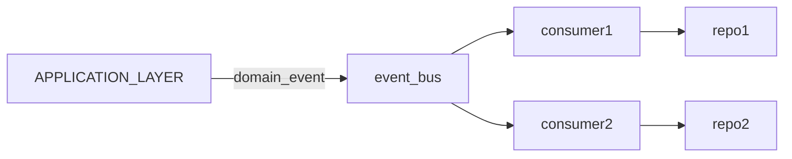

---
{}
---

## 利用数据库本地事务
repo初始化时支持传入一个db的示例，相当于多个repo共享一个db context
伪代码：
```code
db = init_db()

repo1 = Repo1.Init(&db)
repo2 = Repo2.Init(&db)

db.Begin()
repo1.FuncA()
repo2.FuncB()
db.commit()

```

## 基于事件总线的最终一致性方案
在application层不直接操作repo，只是向事件总线发布领域事件


### 如何实现exactly once
1. application层需要确保事件一定成功写入event bus，可由application层的调用方进行重试
2. 每个consumer的消费需要保证幂等性94 基于事务表的幂等方案，确保消费成功后再做kafka的commit