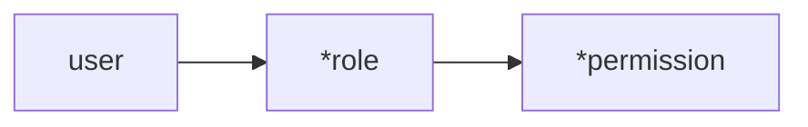
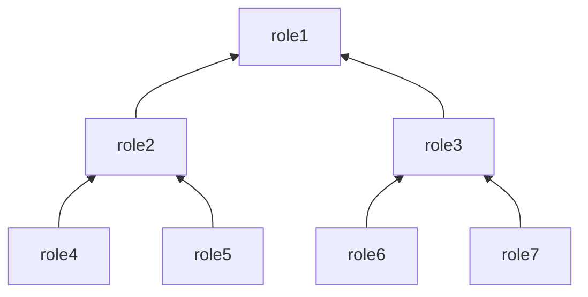
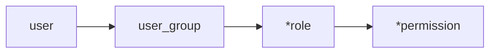
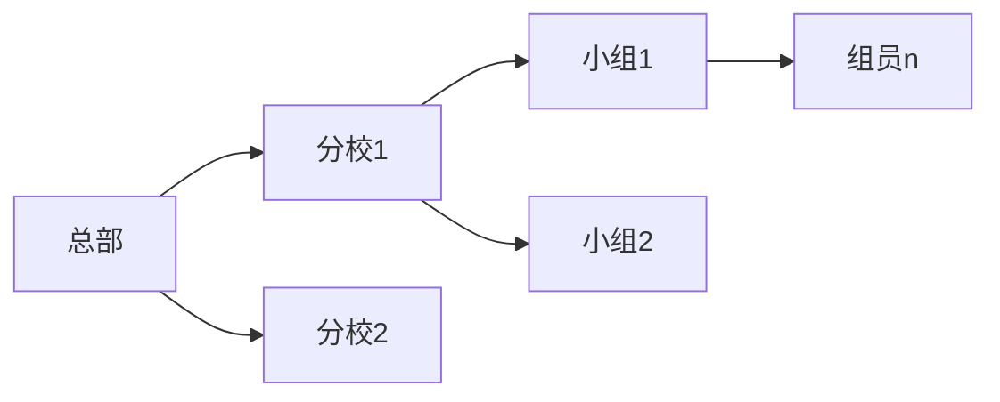
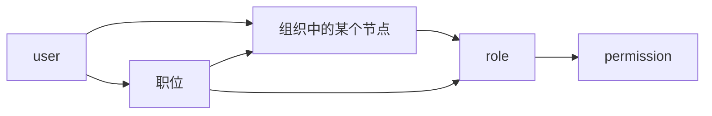

## 定义
RBAC（Role-Based Access Control） 基于角色的访问控制权限
1. 用户不再直接与权限相连，通过角色这一属性来间接被赋予权限
2. 用户与权限解耦

对应的领域模型
1.  用户 user
2.  角色 role
3.  权限 permission

## RBAC分类
RBAC模型分类
-   基本模型RBAC0
-   角色分层模型RBAC1
-   角色限制模型RBAC2
-   统一模型RBAC3
-   基于RBAC的延展——用户组

### RBAC0
user, permission, role之间多对多

### RBAC1 -   Hierarchical RBAC
引入角色继承（hierarchical role）概念，具有上下级的关系

高级别的role（role1）包含低级别的role（role2，role4）的全部权限
继承的分类：
1. 允许多重继承
2. 受限继承，只允许单个继承

### RBAC2-   Constrained RBAC
在RBAC0的基础上，对role进行了约束。

#### 责任分离 separation of duties (SoD)：
1. 互斥角色
	- 必须互斥的角色会存在于同一个集合中，如（裁判员、运动员）
	- user 只能拥有这个集合中的一个角色
2. 基数约束
	- 一个角色被分配的总数受限（只能有一个董事长）
	- 一个用户拥有的角色总数受限
	- 一个角色拥有的权限数量受限
3. 先决条件约束
	- 用户想要获取上级角色，必须先获取其下一级的角色

动态和静态sod：
1. 静态：用户永远无法同时拥有冲突的角色
2. 动态：用户在一次session中无法同时激活相互冲突的角色

### RBAC3- Combines RBAC
RBAC1和RBAC2的一种合集

## 用户组和组织架构 (==不完善==)
当user中包含很多的role时，会增加管理的负担。增加一层用户组的逻辑来简化管理

用户加入用户组后，直接获取这个group的全部role的permission，退出时全部被撤销

### 组织架构
每个组织架构的节点是一个用户组

将组织和角色进行关联，当用户加入组织节点后，自动获得该组织节点的全部角色

### 职位
对组织架构用户组再做拆解,同一个用户组中,不同的职位(组长, 组员)的role不同
