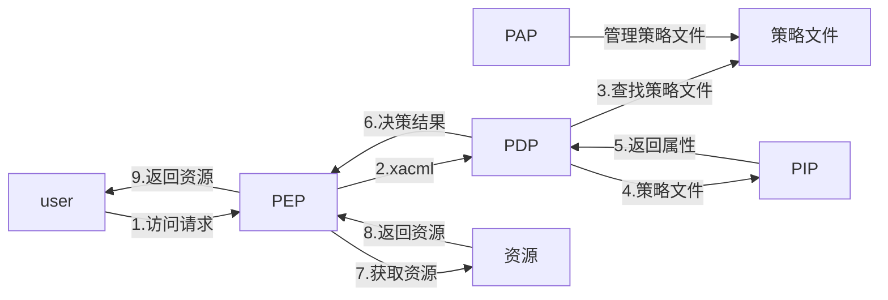

## 定义
**Attribute-based access control** (**ABAC**)
别称：**policy-based access contro**

使用属性而非角色[[10 RBCA 权限模型]]来定义权限归属
依赖各个属性的组合限定条件来决定是否被授权

感觉是对[[10.1 DAC MAC#强制访问控制（MAC Mandatory Access Control）]]的升级拓展

### 优点
1. 相对于RBAC非常灵活
2. 新用户进入时兼容性更好，不用分配role，只需要设定正确的属性。对非组织员工（外包或外部合作伙伴）的兼容性很好
3. 可以在不影响灵活性的情况下实现严格的安全策略，获得类似MAC的优势，例如：
	- 对敏感信息的访问添加地点属性的限制
	- 对敏感信息的访问添加安全等级限制

### 缺点
设计和实现比较复杂

## 组成
![[Pasted image 20210303112416.png]] ![[Pasted image 20210303112522.png|500]]
### subject 
尝试获取资源权限的用户
用户属性可以包含类似属性：
1. ID
2. 组织关系
3. 部门
4. 职级
5. 安全等级

### resource
例如：
1. 文件
2. 应用
3. 服务
4. api

总体指subject尝试获取的资源

### action
用户尝试对resource进行的动作，例如：
1. read
2. write
3. delte

### environment
每次权限获取操作的context，例如：
1. 时间
2. 地点
3. 设备
4. 协议
5. 登录强度

### 示例 
场景：
如果用户是市场部的运营人员，他们应该具有他们部门的媒体策略文件的读写权限

在ABAC下，用户可以获得授权，当且仅当具有如下的属性：
1. subject  具有属性 “工作角色”：“运营”
2. subject 具有属性 “所属部门”：“市场部”
3. action == “edit” || action == “read”
4. resource 具有属性 “类型”：“媒体策略文件”
5. resource 具有属性 “部门”：“市场部”

## ABAC 的授权步骤
- PEP:策略实施节点，构建XACML
- XACML:可扩展访问控制标记语言,基于XML
- PDP:策略决策点
	- 根据xacml查找PAP中的策略文件
	- 根据PIP返回的属性值决定决策结果（permit，deny，不确定）
- PAP：策略管理节点
- PIP:策略信息节点，从策略文件中提取需要的属性值（subject，resource，env）

[xacml](https://www.ibm.com/developerworks/cn/xml/x-xacml/index.html)
## 和RBAC的比较
系统用户的规模是关键，ABAC的优势会在需要大量创建新用户的场景下体现

换个方式讲，ABAC的建设成本非常高，需要很高的用户基础来均摊成本

ABAC的优势场景：
1. 大型组织，大量用户
2. 需要深度的，详细的控制能力
3. 有时间精力进行权限系统的长期建设
4. 需要符合特定的安全和隐私策略

RBAC的优势场景
1. 中小型组织
2. 权限控制是相对宽泛的（不对每个人做特殊定制）
3. 外部的用户很少，组织内的用户是清晰定义的，能够被分配固定的角色

## ref
https://en.wikipedia.org/wiki/Attribute-based_access_control
https://www.jianshu.com/p/ce0944b4a903
https://www.okta.com/blog/2020/09/attribute-based-access-control-abac/
https://www.dnsstuff.com/rbac-vs-abac-access-control
https://blog.csdn.net/blog_empire/article/details/81867433
https://security.stackexchange.com/questions/169875/rbac0-rbac1-rbac2-rbac3-what-do-they-mean