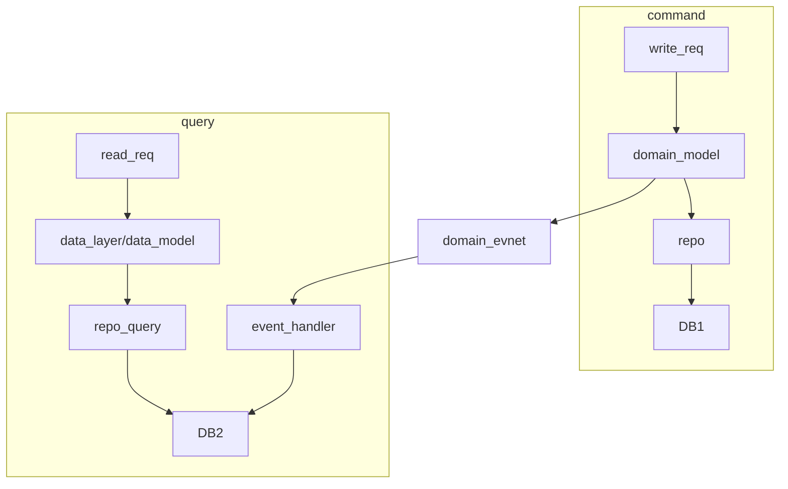

#DDD
## 概要
1. CQRS:Command Query Responsibility Segregation
2. 将领域模型分为命令模型和查询模型
3. 解决的是复杂DTO的拼装问题，避免领域模型去适应页面展示

一个方法只有两种可能的结果;
1. 查询，不影响任何数据 R
2. 命令，修改数据 CUD

部署上，查询服务可以和命令服务独立部署，也可以在同一个服务中

==本质是一种DDD建模层面读写分离==
感觉CQRS放在不同的系统（BC）中就可以认为是一种[[11.1 事件驱动 EDA]]架构，在同一个BC下可以被称为CQRS。
## 实现
### 命令模型
1. 聚合只有命令方法，没有查询方法
2. repo也只有add、save、queryFromID的方法，==不包含按各种条件的查询==

### 查询模型
1. 不反应领域行为，只用于数据显示
2. 数据模型的设计遵循“一张表对应一种数据页面展示”的原则
3. 查询模型的效率可能要求很高，对过滤器、联表查询需要限制

### 架构

整个过程非常类似于基于[[31 阿里云 DTS]]一类的方式进行数据库之间的表同步
不同的点在于这个同步过程不只是单纯的传输数据，会在传输的过程中对数据模型进行变换，在DDD下面，传输的过程基于[[11 事件总线]]
