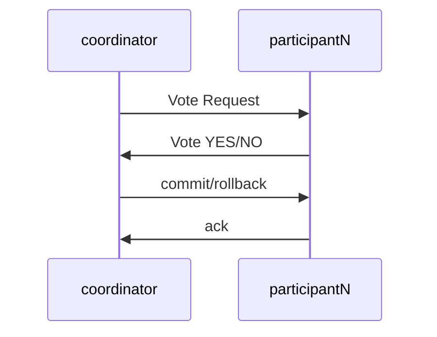
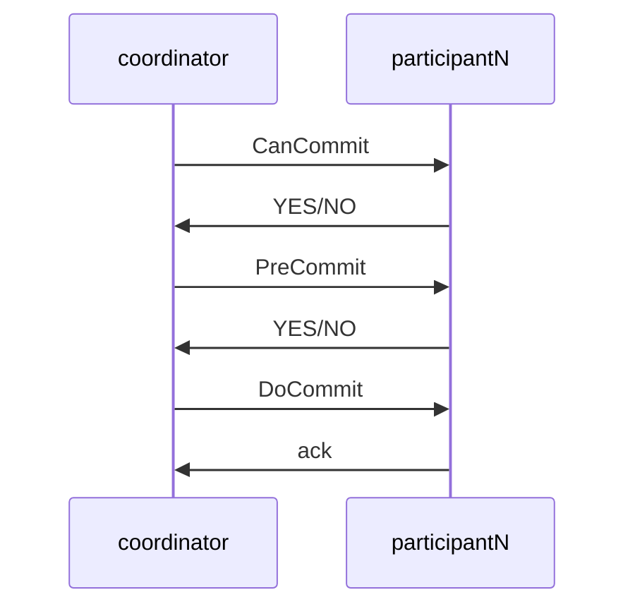

## 概要
1. [XA](https://en.wikipedia.org/wiki/X/Open_XA):一种分布式事务协议
2. ==mysql等数据库原生支持XA协议==
3. XA实现的两种方式：2PC，3PC

### XA的核心概念：
1. 当一个操作包含多个事务时，不是每个事务都一定能够被执行成功的（一致性的约束导致的失败，比如余额不能为负，重试无意义）
2. 如果按顺序提交事务，当发生一个事务无法成功时，需要对前面的所有事务进行回滚
3. 应为前面的事务已经提交，所以在回滚前后访问到的数据不一致，也就导致了强一致的失效

解决的办法是进行预提交
1. 预提交：每个分支事务都先执行DML（数据操纵语言，如SQL），确保这组操作符合一致性约束，可以确保能够成功，但是不提交
2. 对所有的分支事务都进行预提交，确保全部的分支事务都一定可能成功
3. 对全局进行整体的提交，这时除非发生故障，否着提交不可能（因为一致性约束）失败

### 感觉的问题
2PC好像完全没有考虑时序上的问题
一个事务如果发生回滚，那前后达到的请求肯定是不一致的，2PC尝试在解决这个问题

但是从时序的角度将，最后的全局commit发起不可能是同步达到的，如果数据的隔离等级>=RC，那么各个数据库在对外提供服务时依然无法表象出足够的“强一致”，因为他们的表现完全依赖于最后的commit达到的时机

==TODO 强一致性的定义，这里的理解可能有些问题==，这里的强一致应该不是[[93 一致性分类#Strict consistency 严格一致性]]

## 2PC
特点：
1. 强一致
2. 中心化：存在一个中心化的协调者角色（coordinator）

两个阶段：
1. commit-request phase （voting phase）预提交
2. commit parse

在mysql场景中，大概是如下的步骤：
1. coordinator向多个参与者申请开启事务，执行，但是不提交
2. 如果某一个参与者执行失败，就触发全局的rollback，如果所有的参与者第一阶段成功，就触发全局commit

### 缺点
1. 在全局commit/rollback之前，多有参与者都会被阻塞
2. 异常case无法处理，coordinator故障或消息丢失都会导致流程无法正确结束，参与者处于死锁状态

## 3PC
在2PC上增加了CanCommit阶段，并增加超时机制

1. CanCommit：participant对自己的状态进行评估，返回是否有能力完成事务

### 3PC对2PC的改进
本质就是多一个预先检查+自动超时，并没有本质的变化

1. 超时机制
Partcipant在preCommit之后，若长时间没有收到DoCommit，会自动进行本地提交，防止长时间被阻塞

但是自动提交带来了不一致问题

2. CanCommit
这个阶段相当于实现了一次2PC之前的全局检查，可以降低在全局事务执行的过程中participant出问题的可能性

### mysql的XA语法
1. Mysql在XA中扮演participant角色，coordinator在外部
2. MySQL 从5.0.3开始支持XA分布式事务，且只有InnoDB存储引擎支持
3. XA事务和本地事务互斥，开启了一个将无法开启另外一个
4. Mysql 5.7.7之前，处于prepare状态的事务会因为mysql宕机或客户端断联被回滚

基本的操作
1. XA {START|BEGIN} xid
	- 启动一个XA事务，事务置位==ACTIVE==状态
	- xid全局唯一，有外部coordinator决定
2. 本地sql语句执行（DML）
3. XA END xid  结束一个XA事务
	- 将事务置位==IDLE==状态，事务内的sql语句都需要在start和end之间被执行
4. XA PREPARE xid
	- 将事务置位PREPARE状态
	- ==PREPARE其实一种特别的挂起状态，应为在XA END之后也可以跳过2PC直接进行提交==
5. XA COMMIT xid:  事务最终提交，完成持久化
6. XA ROLLBACK xid: 事务回滚终止
7. XA RECOVER: 查看MySQL中存在的PREPARED状态的xa事务

![[Pasted image 20210318173038.png|400]]

#### ref
[[MySQL XA 介绍]]