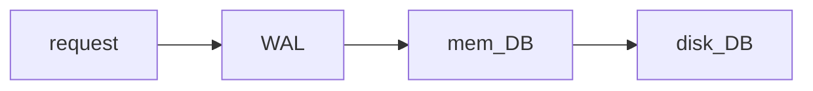

## 概要
1. WAL（Write-ahead logging）的目的是保证数据库写的原子性和持久性（ACID的AD）
2. 在所有操作commit之前必须写入WAL
3. 在要求高的场景必须开启同步刷盘保证WAL的完整性

## WAL的实现
wal一般包含redo和undo两个部分

### redo log
redo log的意义主要是防止写入磁盘被意外中断的情况
1. 以mysql为例，写入磁盘很难在一次磁盘io中完成（多个表，多个索引等），如果用户请求到达后直接写底层存储，中断后很难恢复
1. redoLog先将包含本次写入的所有信息顺序记录到磁盘，再操作底层存储
2. 如果发生中断，redoLog包含了完整的用来效验和恢复的信息

### undo log
undo log其实考虑的是怎么撤销操作的影响，也就是事务的rollback，典型的场景：
1. mysql事务的回滚，[[32.5 MVCC]]
2. AT模式中的undo log [[92.1 seata AT模式#^f500bb]]

## WAL的性能优势
如levelDB一类的数据库完全放弃了实时写底层的存储引擎，写完WAL和内存后就可以返回，可以实现很高的写入QPS，这里依赖的几个基础原理：
1. 宕机是小概率时间，所以即时恢复时间比较长是可以接受的
2. WAL是顺序写的，如果要求不是太高还可以批量异步刷盘，性能非常的好 [[95.1 磁盘读写的优化原则]]
3. WAL一般会循环使用，总体的容量是可控的

## 几种应用
### mysql
对于mysql来说，包含：
1. redo log：保证持久性，在断电等情况下用来修复数据
2. undo log：保证原子性，用来rollback事务

#### zookeeper / etcd
1. 写入操作在完成写WAL和内存后就返回
2. 定时的将内存snapshot刷到磁盘上

这种操作比较典型，为了防止从一个非常长的wal恢复数据，会定期的建立数据的snapshot，每次使用snapshot+WAL增量进行恢复

## ref
[[什么是 WAL]]

